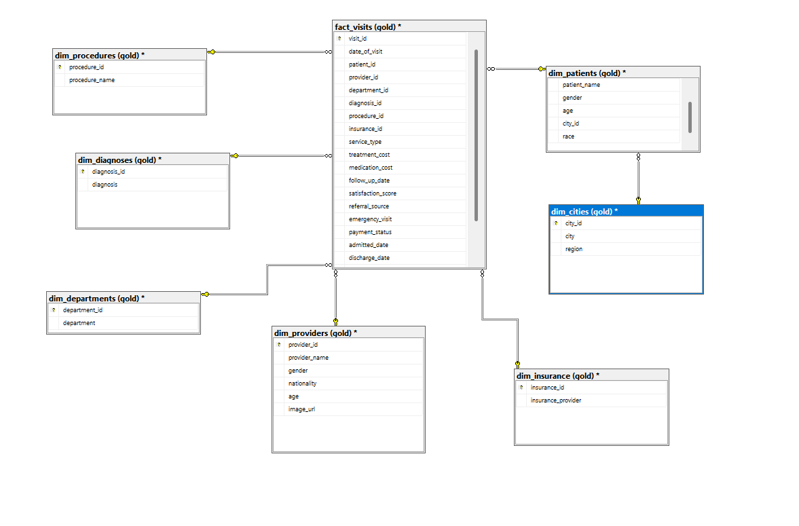
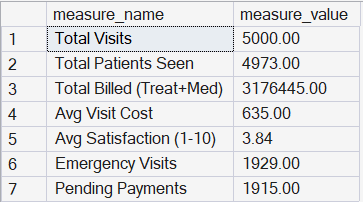
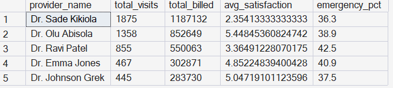
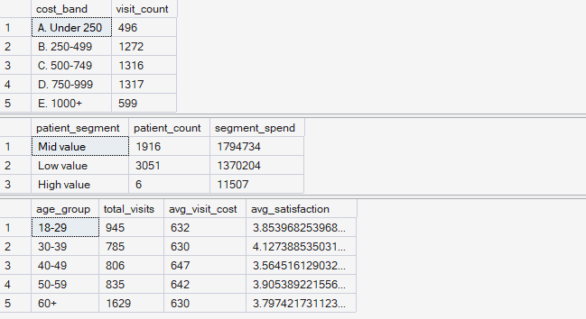
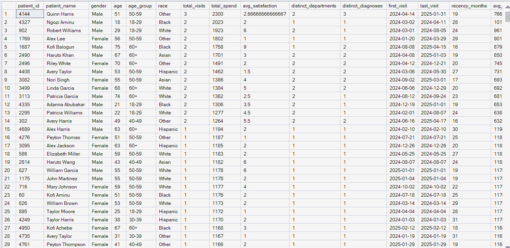
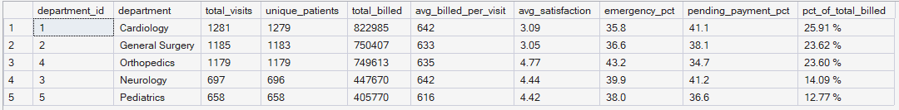
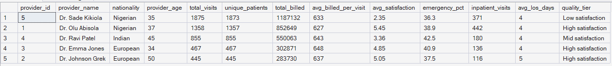

# 🏥 NHS Hospital Analytics — End-to-End SQL Project

An end-to-end SQL analytics project on a patient hospital visits dataset, covering database initialisation, data cleaning, exploratory analysis, advanced window-function analytics, and three production-style reporting views (`gold.report_patients`, `gold.report_providers`, `gold.report_departments`).

Built entirely in **T-SQL (Microsoft SQL Server)** on a custom **star schema** (1 fact table + 7 dimensions) modelling hospital visits.

---

## 📌 Project Overview

This project takes raw, messy hospital visit CSVs and turns them into a clean, queryable star schema, with dim_cities snowflaked one level out via dim_patients, then answers operational, financial, and quality-of-care questions — the kind a hospital analytics or health data team would actually track.

**Domain measure note:** `visit_cost` (a visit's billed amount) = `treatment_cost + medication_cost`. This is the primary revenue/value measure throughout the project. Insurance coverage and room charges are tracked separately. The grain of `fact_visits` is **one row per visit** (one attendance).

---

## 🧱 Data Model & Initialisation

The database build (`00_init_database.sql`) follows a deliberate **stage → clean → load** pattern rather than loading CSVs directly into typed tables:

1. **Staging tables** — all 8 source CSVs land into `NVARCHAR`-only staging tables first, so nothing gets rejected on load regardless of formatting quirks.
2. **Cleaning & type-casting** — staging data is cleaned and cast into the final typed star schema using `TRY_CONVERT` (safely handles bad values as `NULL` instead of erroring), `NULLIF` (empty strings and literal `'N/A'` text → `NULL`), and `TRY_CONVERT(DATE, ..., 101)` to correctly parse US-format (`m/d/yyyy`) dates.
3. **Keys** are added *after* load (source data was already referentially clean), and staging tables are dropped once the typed tables are populated.

| Table | Type | Grain |
|---|---|---|
| `gold.fact_visits` | Fact | One row per hospital visit |
| `gold.dim_patients` | Dimension | One row per patient |
| `gold.dim_providers` | Dimension | One row per provider (doctor) |
| `gold.dim_departments` | Dimension | One row per department |
| `gold.dim_diagnoses` | Dimension | One row per diagnosis |
| `gold.dim_procedures` | Dimension | One row per procedure |
| `gold.dim_insurance` | Dimension | One row per insurance provider |
| `gold.dim_cities` | Dimension | One row per city (linked via patients) |

## Schema

---

## 🔍 Project Structure

### Stage 1 — Data Understanding
Inspected tables and column metadata via `INFORMATION_SCHEMA` before writing business queries.

### Stage 2 — Dimension Exploration
Explored distinct departments, diagnoses, procedures, insurers, service types, referral sources, regions/cities, patient gender/race, and the full provider roster.

### Stage 3 — Date Exploration
Established the visit activity window (first/last visit, span in months), patient age range, and confirmed the admission/discharge date coverage for inpatients specifically.

### Stage 4 — Measures Exploration
Headline KPIs — total billed, total visits, total patients seen, average visit cost, average satisfaction score, and average length of stay for inpatients — consolidated into a single KPI summary table (including emergency visit count and pending payment count).

### Stage 5 — Magnitude Analysis
Measures broken down across every dimension: department, diagnosis, procedure, service type (Outpatient/Inpatient/Emergency), region, gender, race, insurance provider (payer mix with average coverage), referral source, and payment status share.

### Stage 6 — Ranking Analysis
- Top 3 diagnoses by billed value (using both `TOP` and `RANK()` window function to demonstrate equivalence)
- Full provider league table: volume, revenue, satisfaction, emergency rate
- Best and worst average-satisfaction providers (minimum 100-visit threshold to avoid small-sample noise)
- Top 10 cities by patient volume

### Stage 7 — Advanced Analytics
- **Change over time:** yearly and monthly visit/billing trends, plus month-of-year seasonality across all years combined
- **Cumulative analysis:** running total of billed value and a 3-month moving average of visit cost, using `SUM() OVER()` and `AVG() OVER (ROWS BETWEEN 2 PRECEDING AND CURRENT ROW)`
- **Performance analysis:** month-on-month billing change using `LAG()` with an Up/Down/Flat trend flag, plus department revenue benchmarked against the overall department average (Above/Below Average)
- **Part-to-whole analysis:** each department's percentage share of total billed value, using `SUM() OVER()` as the denominator
- **Segmentation:**
  - Visits grouped into cost bands (`Under 250` through `1000+`)
  - Patients grouped into **High / Mid / Low value** based on lifetime spend across all visits
  - Age-group analysis (18–29, 30–39, 40–49, 50–59, 60+) against visit volume, cost, and satisfaction

### Stage 8 — Reporting Views
Three reusable views productionising the analysis above:

**`gold.report_patients`**
One row per patient with total visits, total spend, average satisfaction, distinct departments/diagnoses seen, first/last visit dates, recency (months since last visit), average cost per visit, age group, and a value segment (High/Mid/Low).

**`gold.report_providers`**
One row per provider with total visits, unique patients treated, total billed, average billed per visit, average satisfaction, emergency visit percentage, inpatient visit count, average length of stay, and a quality tier (High/Mid/Low satisfaction).

**`gold.report_departments`**
Department-level scorecard with total visits, unique patients, total billed, average billed per visit, average satisfaction, emergency percentage, **pending payment percentage** (a payment-risk indicator), and each department's percentage share of total billed value.

---

## 🛠️ Technical Skills Demonstrated

- Full data pipeline: staging → cleaning → typed star schema → keys, using `TRY_CONVERT`, `NULLIF`, and defensive `BULK INSERT` handling for messy real-world CSVs
- Star-schema design (1 fact + 7 dimensions) with correct grain (one row per visit)
- Window functions: `RANK()`, `LAG()`, `SUM() OVER()`, `AVG() OVER()` with custom frames
- CTEs for multi-step, readable transformations
- `CASE`-based segmentation (patient value tiers, cost bands, age groups, provider quality tiers)
- Time intelligence: `DATEPART`, `DATETRUNC`, `DATEDIFF`, `DATENAME`
- Healthcare-specific KPIs: length of stay, emergency visit rate, payment/pending status, insurance coverage
- View creation for reusable, production-style reporting layers
- Defensive `CASE`/`NULLIF` guards against divide-by-zero in derived KPIs

---

## 📊 Major Outputs

 **KPI Summary Table**
 
  

**Provider League Table** 

 

**Segmentations** 

 

**Patient Report**

 

**Department Report**

 

**Provider Report**

---

## 📁 Files

- [`00_init_database.sql`](00_init_database.sql) — database creation, star schema DDL, staging → clean → load pipeline
- [`NHS_Hospital_Analytics_EDA.sql`](NHS_Hospital_Analytics_EDA.sql) — full analysis script, stages 1–8

*Note: Data cleaning logic in `00_init_database.sql` (handling mixed line endings, US date formats, and staging-table type casting) was built with AI-assisted development to handle edge cases efficiently. The exploratory and advanced analytics queries, segmentation logic, and reporting views in `NHS_Hospital_Analytics_EDA.sql` were written independently.*

---

## 👤 Author

**Anandu Karunakaran**
MSc Business Analytics (Distinction) — Aston University
📧 anandukaran@gmail.com
